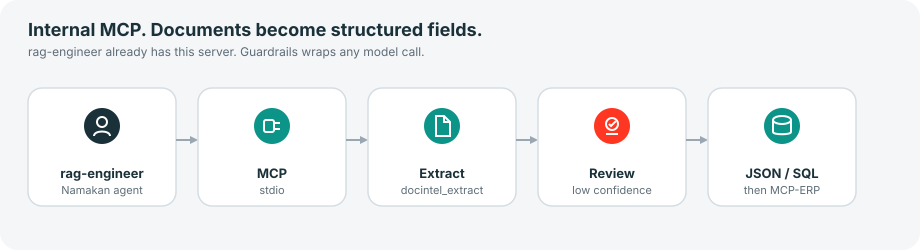
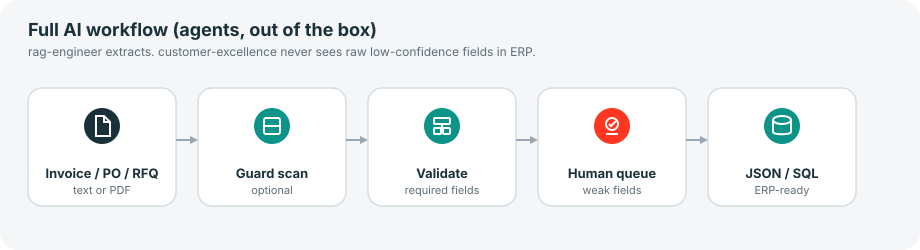
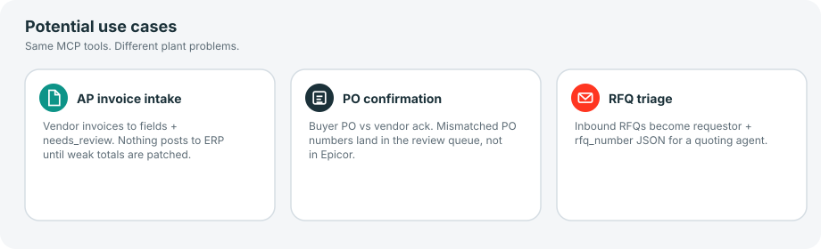

# namakan-docintel

Internal MCP server that turns invoices, purchase orders, and RFQs into structured fields — schema, per-field confidence, human review queue **before** ERP.

The plant GM does not paste a config. `rag-engineer` (and `ml-engineer`, `ai-solutions-architect`) already have this server after bootstrap. Model calls go through `namakan-guardrails` on the same profiles.

## How agents connect

```yaml
mcp_servers:
  namakan-docintel:
    command: uvx
    args:
      - --from
      - git+https://github.com/cfollette18/namakan-docintel.git
      - namakan-docintel
      - serve
    trust: full
```

Hermes launches that from the agent profile. Heuristic parsers ship; a vision LLM is optional later. Keep this package as the validation layer.

## Architecture



## Full AI workflow



Playbook path (`playbooks/phase-2-document-extraction.md`):

1. `solution-architect` confirms document types. Do not start with “a model.”
2. `rag-engineer` calls `docintel_extract` (or `docintel_run_workflow` on synthetic data).
3. Low-confidence fields stay on the review queue. `customer-excellence` never ships raw guesses to Epicor.
4. JSON/SQL adapter. `integration-engineer` lands it via `namakan-mcp-erp` if the destination is the ERP.

Demo without an agent process:

```bash
namakan-docintel workflow
```

Expected: four JSON steps. `fields.invoice_number` is `INV-1001`. SQL starts with `INSERT INTO staging_docs`.

## Tools

| Tool | What the agent does |
|---|---|
| `docintel_types` | Document types and required fields |
| `docintel_extract` | Parse `text` (`invoice`, `po` / `purchase-order`, `rfq`) |
| `docintel_to_sql` | `INSERT` statements from extracted rows |
| `docintel_run_workflow` | Sample document → extract → review → SQL |

## Potential use cases



| Use case | Which agent | Why it matters |
|---|---|---|
| AP invoice intake | `rag-engineer` | Stops re-keying. Weak totals never hit Epicor. |
| PO confirmation | `rag-engineer` | Mismatched PO numbers land in the review queue. |
| RFQ triage | `ml-engineer` | Requestor + rfq_number without treating PDF text as instructions. |

`use_case` on `docintel_run_workflow`: `ap-invoice-intake` (default), `po-confirmation`, `rfq-triage`.

## Tests

```bash
pip install -e ".[dev]"
pytest
```

## License

MIT. Copyright (c) 2026 Namakan AI Engineering.
