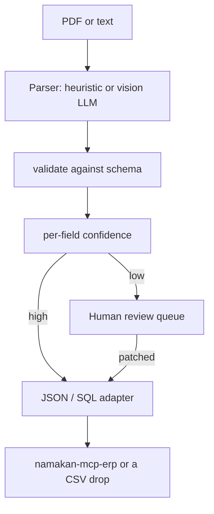

# namakan-docintel

Extract structured fields from invoices, purchase orders, and RFQs. Validates a schema, scores confidence per field, and parks weak fields in a review queue **before** anything is written to ERP.

Works **without a model**. A heuristic parser ships for invoices / POs / RFQs. Plug in a vision LLM later; keep this package as the validation layer.

The public generic invoice schema lives here. Client-specific schemas and golden eval sets stay private.

## Run in 60 seconds

```bash
pip install git+https://github.com/cfollette18/namakan-docintel.git
namakan-docintel demo
```

Parse the sample files in this repo:

```bash
git clone https://github.com/cfollette18/namakan-docintel.git
cd namakan-docintel
pip install -e .
namakan-docintel extract examples/sample_invoice.txt
namakan-docintel extract examples/sample_po.txt --type po
namakan-docintel extract examples/sample_rfq.txt --type rfq --jsonl /tmp/rfq.jsonl --sql /tmp/rfq.sql
```

## How a document moves



Low-confidence is a feature. A confident wrong PO number in production ERP is the failure mode this exists to prevent.

## CLI

| Command | What it does |
|---|---|
| `namakan-docintel demo` | Parse the bundled sample invoice, print JSON |
| `namakan-docintel types` | Document types and required fields |
| `namakan-docintel extract FILE...` | Parse real files (`--type invoice\|po\|rfq`) |
| `--jsonl PATH` | Write one JSON object per document |
| `--sql PATH --table invoices` | Write `INSERT` statements |
| `--review-below 0.7` | Confidence threshold for the review queue |

`needs_review` in the JSON is the list of fields a human should touch. `unknown` / empty / `n/a` scores 0.2.

## Python

```python
from namakan_docintel import extract, parse_invoice, ReviewQueue, to_sql_inserts

text = open("examples/sample_invoice.txt").read()
doc = extract(text, parse_invoice)
queue = ReviewQueue()
queue.enqueue("inv-1", doc)
print(doc.fields, doc.needs_review)
print(to_sql_inserts(queue.to_json_rows([doc])))
```

To use a model instead of the heuristic, wrap the call with `namakan-guardrails` and pass your own `parser(text) -> dict`:

```python
from namakan_docintel import extract, INVOICE_SCHEMA

def parser(text: str) -> dict:
    # vision LLM here; must return the schema keys
    ...

doc = extract(text, parser, schema=INVOICE_SCHEMA)
```

Install `namakan-docintel[guardrails]` if you want ingested text scanned for injection before parse.

## Document types

| `--type` | Required fields |
|---|---|
| `invoice` | vendor_name, invoice_number, total |
| `po` / `purchase-order` | buyer_name, po_number, vendor_name |
| `rfq` | requestor, rfq_number |

## Leak-guard

No client PDFs, real vendor names of paying customers, or private eval corpora. Samples in `examples/` are invented.

## License

MIT. Copyright (c) 2026 Namakan AI Engineering.
